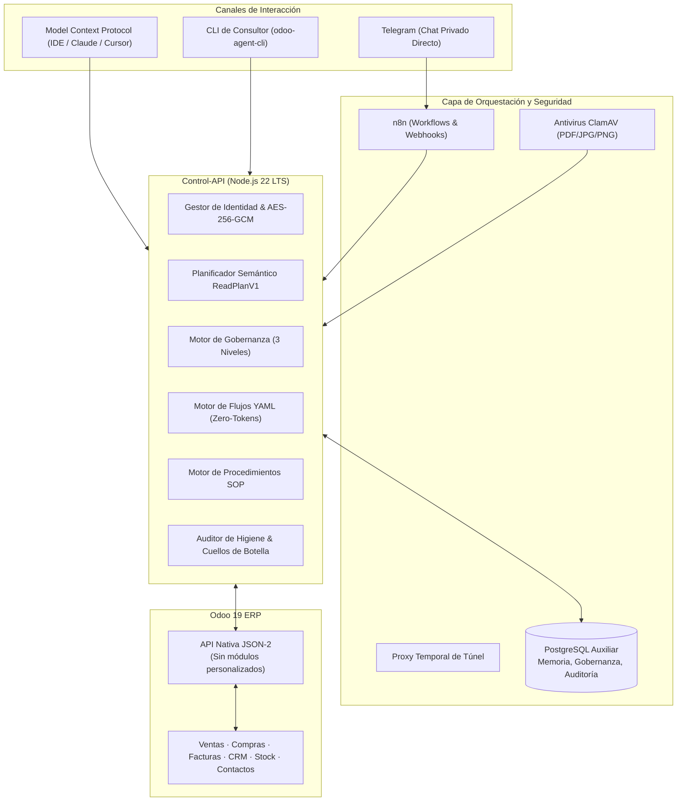

# Agente de Inteligencia Artificial para Clientes Odoo 🚀

[](https://github.com/jjaraujoa/Odoo-AI-Client-Agent/actions/workflows/ci.yml)
[](LICENSE)
[](https://nodejs.org/)
[-purple.svg)](https://www.odoo.com/)
[](https://modelcontextprotocol.io/)

> **Un consultor y asistente 24/7 para tu empresa.**  
> Plataforma conversacional, copiloto empresarial y motor autónomo de flujos para **Odoo (versiones 16 a 20)** que opera a través de Telegram, Model Context Protocol (MCP) y CLI, conectándose nativamente **sin instalar módulos personalizados en el ERP (Zero Custom Addons)**.

*Read this document in English: [README.md](README.md)*

---

## 💡 ¿Por Qué Odoo AI Client Agent? (Beneficios para tu Empresa)

Las empresas que implementan Odoo a menudo enfrentan fricción cuando sus empleados comerciales, de almacén o directivos necesitan consultar métricas, registrar prospectos o crear borradores sobre la marcha. Los desarrollos tradicionales en Python encarecen el mantenimiento, complican las migraciones y abren riesgos de seguridad.

**Odoo AI Client Agent** funciona como un nuevo integrante del equipo: un analista estratégico, facilitador operativo y consultor de procesos continuo:

1. **📊 Analista estratégico 24/7**: Resume el estado de ventas, inventario y finanzas al instante, genera reportes periódicos y advierte sobre cuellos de botella o malas prácticas antes de que cuesten dinero.
2. **⚡ Potencia la productividad del equipo**: Cada colaborador cuenta con un copiloto inteligente a la mano que conoce qué pasos deben darse dentro del sistema.
3. **📈 Informes a medida en lenguaje natural**: Pídele la información como si hablaras con un colega y obtén reportes claros, visuales y con datos en tiempo real.
4. **🧹 Eliminación de trabajo monótono**: Reduce las tareas repetitivas y masivas que consumen horas al personal y lastran la agilidad del negocio.
5. **🎓 Menor curva de aprendizaje**: Acompaña paso a paso a los nuevos empleados que apenas están aprendiendo a utilizar Odoo.
6. **📱 Multicanal y sin costes ocultos**: Opéralo desde **Telegram** (próximamente **WhatsApp y Teams**) y conéctalo en tu escritorio a **Claude, ChatGPT o Cursor**, aprovechando las suscripciones de IA que tu empresa ya tiene contratadas.
7. **⚙️ Automatización y Odoo Studio**: Agiliza la creación de flujos automatizados y simplifica la ejecución de registros masivos.
8. **🛡️ Seguridad y tranquilidad directiva**: Cero riesgo de que la IA altere datos críticos por su cuenta; las operaciones clave siempre requieren confirmación humana, y cada empleado solo accede a lo que sus permisos de Odoo le permiten.
9. **🔌 Cero instalaciones invasivas**: Conecta directo y limpio sin instalar módulos extraños en tu Odoo ni asumir costosos desarrollos a medida.
10. **🔓 Libertad absoluta y cero ataduras**: Licencia Open Source (MIT); tu empresa no depende de una consultora ni tiene que pagar licencias mensuales por cada usuario.
11. **🧱 Blindaje contra ciberataques**: Incluye capas de seguridad perimetral para proteger tu base de datos contra accesos no autorizados y manipulación de instrucciones (*prompt injection*).

---

### 📌 Compatibilidad de Versiones y Despliegue
- **Versiones de Odoo**: Disponible y optimizado para **Odoo 19**, con compatibilidad y soporte para **Odoo 16, 17, 18 y la próxima versión 20** (mediante API estándar).
- **Ediciones**: Odoo **Enterprise** y Odoo **Community**.
- **Entornos**: Odoo **Online (SaaS)**, Odoo.sh y servidores locales/propios (**On-Premise**).

---

## 🏗️ Arquitectura del Sistema


```mermaid
flowchart TD
    subgraph Canales["Canales de Interacción"]
        TG["Telegram (Chat Privado Directo)"]
        MCP["Model Context Protocol (IDE / Claude / Cursor)"]
        CLI["CLI de Consultor (odoo-agent-cli)"]
    end

    subgraph Orquestacion["Capa de Orquestación y Seguridad"]
        N8N["n8n (Workflows & Webhooks)"]
        PROXY["Proxy Temporal de Túnel"]
        CLAM["Antivirus ClamAV (PDF/JPG/PNG)"]
        DB[(PostgreSQL Auxiliar\nMemoria, Gobernanza, Auditoría)]
    end

    subgraph Core["Control-API (Node.js 22 LTS)"]
        ID["Gestor de Identidad & AES-256-GCM"]
        PLAN["Planificador Semántico ReadPlanV1"]
        GOV["Motor de Gobernanza (3 Niveles)"]
        DSL["Motor de Flujos YAML (Zero-Tokens)"]
        SOP["Motor de Procedimientos SOP"]
        AUDIT["Auditor de Higiene & Cuellos de Botella"]
    end

    subgraph ERP["Odoo 19 ERP"]
        ODOO_API["API Nativa JSON-2\n(Sin módulos personalizados)"]
        MODELS["Ventas · Compras · Facturas · CRM · Stock · Contactos"]
    end

    TG --> N8N
    N8N --> Core
    MCP --> Core
    CLI --> Core
    CLAM --> Core
    Core <--> DB
    Core <--> ODOO_API
    ODOO_API <--> MODELS
```

---

## ⚡ Capacidades Principales

### 1. Planificador Semántico de Lectura (`ReadPlanV1`)
- Interpreta lenguaje natural y genera planes de ejecución declarativos en JSON.
- **Catálogo Cerrado**: Solo consulta campos explícitamente autorizados. Bloquea de inmediato campos sensibles (contraseñas, tokens de pago, firmas).
- Nunca ejecuta código Python ni métodos `eval` arbitrarios en el ERP.

### 2. Gobernanza de Acciones Operativas en 3 Niveles
Toda acción de escritura respeta una matriz de gobernanza estricta:
- **Nivel 1 (Autónoma)**: Crear borradores de cotizaciones, reasignar responsables o actualizar notas internas.
- **Nivel 2 (Asistida / Notificada)**: Cambiar etapas en CRM o modificar líneas de pedido; se ejecuta y notifica automáticamente al supervisor vía Telegram.
- **Nivel 3 (Crítica / Aprobación Humana)**: Confirmar pedidos de venta o validar albaranes de entrega; genera un código de un solo uso con ventana de 15 minutos para aprobación interactiva.

### 3. Motor de Flujos de Negocio Declarativos (DSL YAML)
Permite definir recetas automatizadas de negocio sin gastar tokens de LLM:
```yaml
name: pedido-urgente-facturar
trigger:
  model: sale.order
  event: on_write
condition: "record.state == 'sale' and record.amount_total >= 5000000"
steps:
  - action: odoo.create_draft_invoice
    policy: autonomous
  - action: odoo.assign_responsible
    params:
      user_id: 12
    policy: notify_supervisor
```

### 4. Servidor MCP Integrado (`odoo-mcp`)
Conecta Odoo 19 directamente con tu entorno de desarrollo o asistente de escritorio compatible con Model Context Protocol:
- Herramientas de lectura: `consultar_orden_venta`, `consultar_inventario`, `consultar_facturas_cliente`, `consultar_oportunidades_crm`.
- Herramientas operativas: `crear_orden_venta_borrador`, `confirmar_orden_venta`, `reasignar_responsable`.
- Procedimientos SOP y Auditorías de Negocio.

### 5. Auditorías de Higiene de Datos y Detección de Cuellos de Botella
Audita la base de datos de Odoo automáticamente y genera reportes de salud empresarial:
- **Higiene**: Clientes sin identificación fiscal (NIT/RUT), productos sin coste o existencias negativas.
- **Cuellos de Botella**: Pedidos confirmados pendientes de facturar, albaranes retrasados con respecto a la fecha prevista.

---

## 🚀 Inicio Rápido (Quickstart)

### Opción A: Despliegue con Docker Compose (Recomendado)

1. **Clonar el repositorio**:
   ```bash
   git clone https://github.com/jjaraujoa/Odoo-AI-Client-Agent.git
   cd Odoo-AI-Client-Agent
   ```

2. **Configurar el entorno**:
   ```bash
   cp .env.example .env
   # Configura las contraseñas de Postgres y la clave maestra AES-256 (32 bytes en base64)
   ```

3. **Iniciar los servicios**:
   ```bash
   docker compose up -d
   ```

4. **Verificar el estado**:
   ```bash
   curl http://localhost:8080/health
   # {"status":"ok","timestamp":"..."}
   ```

---

### Opción B: Ejecución Local o WSL2 (Sin Docker)

1. **Instalar dependencias de Node.js**:
   ```bash
   cd control-api
   npm install
   ```

2. **Ejecutar suite de pruebas (121 pruebas)**:
   ```bash
   npm run check
   ```

3. **Iniciar la API de Control**:
   ```bash
   npm start
   ```

---

## 💻 CLI del Consultor (`odoo-agent-cli`)

El repositorio incluye una herramienta de línea de comandos para facilitar la labor de consultores Odoo:

```bash
# Inicializar la carpeta aislada para un nuevo cliente
node control-api/bin/odoo-agent-cli.js client init \
  --slug mi-empresa \
  --name "Mi Empresa S.A.S." \
  --url "https://mi-empresa.odoo.com" \
  --db "mi-empresa-db"

# Validar la plantilla de usuarios Excel
node control-api/bin/odoo-agent-cli.js users validate --file ./onboarding/consultant-kit/Plantilla-Users.xlsx

# Extraer el diccionario de datos de Odoo 19 (incluyendo campos Studio)
node control-api/bin/odoo-agent-cli.js schema dump --client mi-empresa

# Crear y validar un nuevo flujo de trabajo en YAML
node control-api/bin/odoo-agent-cli.js flow new --client mi-empresa --name orden-alta-prioridad
node control-api/bin/odoo-agent-cli.js flow validate --path clients/mi-empresa/workflows/orden-alta-prioridad.yaml
```

---

## 🔒 Seguridad y Cumplimiento

- **Sin Exposición de Secretos**: Ninguna clave de Odoo o token de Telegram se muestra en texto plano ni se registra en logs.
- **Acciones Destructivas Prohibidas**: El agente tiene bloqueada por arquitectura la eliminación de registros (`unlink`), la publicación de facturas definitivas o la conciliación bancaria directa.
- **Aislamiento Multi-inquilino**: Las sesiones de memoria y los límites de consumo están estrictamente particionados por cliente y usuario.

Para reportes de seguridad, consulta nuestra [Política de Seguridad](SECURITY.md).

---

## 🤝 Cómo Contribuir

¡Las contribuciones de la comunidad son bienvenidas! Revisa nuestra [Guía de Contribución](CONTRIBUTING.md) para conocer las pautas de estilo, arquitectura y proceso de Pull Requests.

---

## 📄 Licencia

Este proyecto está bajo la [Licencia MIT](LICENSE) - consulta el archivo [LICENSE](LICENSE) para más detalles.

---

**Desarrollado con ❤️ por [Jorge Araujo](https://github.com/jjaraujoa) / XETA.**
