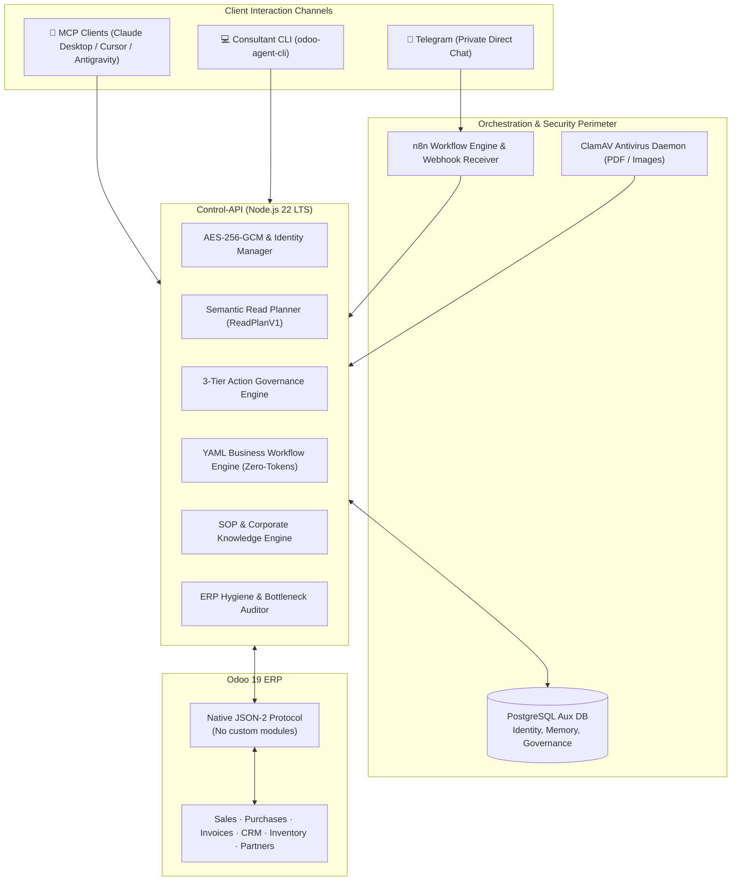

# Odoo AI Client Agent 🚀

[](https://github.com/jjaraujoa/Odoo-AI-Client-Agent/actions/workflows/ci.yml)
[](LICENSE)
[](https://nodejs.org/)
[-purple.svg)](https://www.odoo.com/)
[](https://modelcontextprotocol.io/)

> **Enterprise-grade conversational AI Copilot, MCP Server, and autonomous workflow engine for Odoo 19.**  
> Seamlessly connects with Odoo via its native **JSON-2 API with Zero Custom Addons required**.

[🇪🇸 **¿Prefieres leer en Español? Haz clic aquí para ver la documentación completa en español.**](README.es.md)

---

## 💡 Why Odoo AI Client Agent?

Enterprises running Odoo often struggle to give mobile field teams, sales reps, and executives instant access to ERP data. Building custom Odoo Python modules increases maintenance overhead, breaks during yearly version upgrades, and exposes internal ORM vulnerabilities.

**Odoo AI Client Agent** redefines ERP automation:
- **Zero Custom Addons**: Interacts with Odoo 19 exclusively over standard JSON-2 endpoints using individual user API keys.
- **3-Tier Operational Governance**: Balances agility and safety with autonomous low-risk tasks, supervisor-notified actions, and time-expiring confirmation codes for critical operations.
- **Multi-Interface Ready**: Works through Telegram private direct chats, desktop AI clients via **Model Context Protocol (MCP)**, and a dedicated Consultant CLI.
- **Declarative Business Workflows (YAML)**: Executes multi-step business logic and triggers without consuming expensive LLM tokens on every event.
- **Bank-Grade Cryptography**: AES-256-GCM encrypted credential vaults and RSA-3072 sealed onboarding packages (`.odooai`).

---

## 🏗️ Architecture Overview



---

## ✨ Key Features

### 1. 🛡️ Semantic Read Planner (`ReadPlanV1`)
Queries are translated into bounded, declarative execution plans. 
- Strict semantic field catalog and operator white-listing.
- Prevents technical model/field injection or prompt-leakage of database internals.
- Enforces user-specific Odoo multi-company and record-rule boundaries.

### 2. 🚦 3-Tier Operational Governance
Every write action adheres to a deterministic governance matrix:
- **Tier 1 (Autonomous)**: Create draft quotations, reassign sales representatives, update internal notes.
- **Tier 2 (Supervised / Notified)**: Advance CRM stages or alter order lines; automatically notifies the team lead via Telegram.
- **Tier 3 (Critical / Human-in-the-Loop)**: Confirm sale orders or validate warehouse pickings; generates a secure 6-digit confirmation code with a 15-minute expiration window.

### 3. 📑 Declarative Business Workflows (DSL YAML)
Define business workflows that run deterministically in sub-milliseconds:
```yaml
name: high-value-sale-auto-invoice
trigger:
  model: sale.order
  event: on_write
condition: "record.state == 'sale' and record.amount_total >= 10000"
steps:
  - action: odoo.create_draft_invoice
    policy: autonomous
  - action: odoo.assign_responsible
    params:
      user_id: 14
    policy: notify_supervisor
```

### 4. 🔌 Model Context Protocol (MCP) Server
Integrate your Odoo 19 instance directly into Claude Desktop, Cursor, or any MCP-compliant AI assistant:
```json
{
  "mcpServers": {
    "odoo": {
      "command": "node",
      "args": ["/path/to/control-api/bin/odoo-mcp.js", "--client", "demo-client"]
    }
  }
}
```
Available tools include `consultar_orden_venta`, `consultar_inventario`, `consultar_facturas_cliente`, `crear_orden_venta_borrador`, `confirmar_orden_venta`, and ERP health audits.

### 5. 🩺 ERP Health & Bottleneck Audits
Automated diagnostic tools that continuously scan Odoo for operational risks:
- **Data Hygiene**: Partners missing tax IDs (NIT/RUT), products with zero standard cost, negative stock levels.
- **Bottlenecks**: Confirmed sale orders pending invoicing, delayed delivery slips past scheduled dates.

---

## ⚡ Quickstart

### Option A: Docker Compose (Recommended for Production)

1. **Clone the repository**:
   ```bash
   git clone https://github.com/jjaraujoa/Odoo-AI-Client-Agent.git
   cd Odoo-AI-Client-Agent
   ```

2. **Configure your environment**:
   ```bash
   cp .env.example .env
   # Set your POSTGRES_PASSWORD, ODOO_CREDENTIAL_MASTER_KEY_B64, and LLM keys
   ```

3. **Launch the stack**:
   ```bash
   docker compose up -d
   ```

4. **Verify service health**:
   ```bash
   curl http://localhost:8080/health
   # Returns: {"status":"ok","timestamp":"..."}
   ```

---

### Option B: Local / WSL 2 Development

1. **Install dependencies**:
   ```bash
   cd control-api
   npm install
   ```

2. **Run automated test suite (121 unit & integration tests)**:
   ```bash
   npm run check
   ```

3. **Start the Control API**:
   ```bash
   npm start
   ```

---

## 🛠️ Consultant CLI (`odoo-agent-cli`)

A developer-friendly CLI is included to automate client setup and workflow testing:

```bash
# Initialize an isolated client workspace
node control-api/bin/odoo-agent-cli.js client init \
  --slug acme-corp \
  --name "ACME Corporation" \
  --url "https://acme.odoo.com" \
  --db "acme-prod"

# Validate employee onboarding Excel template
node control-api/bin/odoo-agent-cli.js users validate --file ./onboarding/consultant-kit/Plantilla-Users.xlsx

# Dump ERP schema (including custom Studio fields)
node control-api/bin/odoo-agent-cli.js schema dump --client acme-corp

# Scaffold and validate a business workflow
node control-api/bin/odoo-agent-cli.js flow new --client acme-corp --name fast-track
node control-api/bin/odoo-agent-cli.js flow validate --path clients/acme-corp/workflows/fast-track.yaml
node control-api/bin/odoo-agent-cli.js flow test --path clients/acme-corp/workflows/fast-track.yaml --payload '{"state":"sale","amount_total":15000}'
```

---

## 🔒 Security Principles

- **No Destructive Operations**: `unlink` (record deletion), bank payment reconciliation, and mass partner creation are hard-blocked by design.
- **Never In Plain Text**: Individual Odoo user API keys and Telegram bot tokens are never logged, never returned in API payloads, and stored under AES-256-GCM.
- **Isolated Memory**: Chat history and conversational context are partitioned per `(client_id, chat_id, user_id)`.

Review our [Security Policy](SECURITY.md) for responsible disclosure.

---

## 🤝 Contributing

Contributions are warmly welcomed! Please read our [Contributing Guidelines](CONTRIBUTING.md) to learn about our code standards, test requirements, and Pull Request process.

---

## 📜 License

This project is licensed under the **MIT License** - see the [LICENSE](LICENSE) file for details.

---

**Crafted with care by [Jorge Araujo](https://github.com/jjaraujoa) / XETA.**  
*Empowering enterprises with intelligent, safe, and transparent Odoo ERP copilots.*
