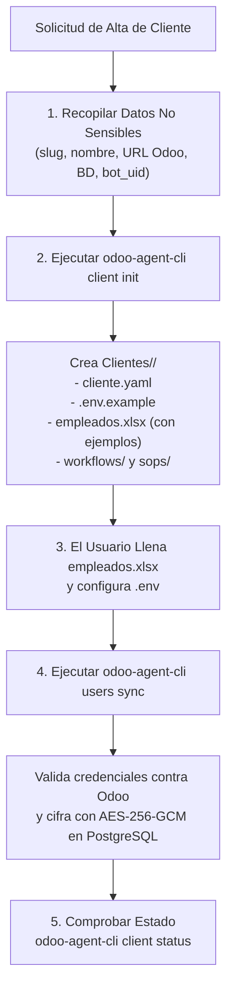

# Skill: Instalación Segura y Aislada de Clientes Odoo 19

Esta skill guía y automatiza el proceso completo de alta, configuración y puesta en marcha de un nuevo cliente empresarial en el ecosistema **Odoo-AI-Client-Agent**, asegurando el aislamiento estricto de datos, recetas de flujos y secretos en `/Users/jorgearaujo/Proyectos/XETA/Clientes/<slug>/`.

---

## Cuándo Activar esta Skill

- Cuando el usuario solicite: *"Instala un nuevo cliente"*, *"Quiero configurar una nueva empresa/BD en Odoo"*, *"Crea la carpeta para el cliente X"* o *"Sincroniza los usuarios de un cliente"*.
- Cuando se requiera preparar el entorno local para conectar una nueva base de datos de pruebas o producción en Odoo 19.

---

## Flujo de Trabajo Paso a Paso



---

## Procedimiento Detallado

### Paso 1: Recopilación de Datos No Sensibles
Solicita al usuario únicamente los datos que no representan riesgo de seguridad:
1. **Slug del cliente**: Identificador único en minúsculas (ej. `mi-empresa-stage`).
2. **Nombre de la empresa**: Nombre legible (ej. `Mi Empresa Pruebas Odoo 19`).
3. **URL Base de Odoo**: Dirección HTTPS de Odoo sin sufijos adicionales (ej. `https://mi-empresa.odoo.com`).
4. **Nombre de la BD**: Base de datos en Odoo (ej. `mi-empresa`).
5. **ID del Bot de Odoo (opcional pero recomendado)**: ID numérico del usuario de servicio en Odoo para la regla anti-bucles en 0 tokens (ej. `15`).

### Paso 2: Inicialización de la Carpeta Aislada
Ejecuta el comando del CLI desde el directorio `control-api/`:

```bash
./bin/odoo-agent-cli.js client init \
  --slug <slug> \
  --name "<nombre>" \
  --url "<odoo_base_url>" \
  --db "<odoo_database>" \
  --bot-uid <bot_uid>
```

Esto generará automáticamente en `/Users/jorgearaujo/Proyectos/XETA/Clientes/<slug>/`:
- `cliente.yaml`: Metadatos públicos de conexión.
- `.env.example`: Plantilla de variables secretas.
- `usuarios.xlsx`: Copia de `Plantilla-Users.xlsx` con registros de ejemplo para guiar al usuario.
- `workflows/`: Directorio aislado para recetas declarativas en YAML.
- `sops/`: Directorio aislado para procedimientos operativos estándar en Markdown.
- Registro del cliente en la base de datos PostgreSQL (`agent.clients`).

### Paso 3: Configuración de Secretos y Usuarios
Indica al usuario de forma clara:
1. **Secretos**: Copiar `.env.example` a `.env` en la carpeta del cliente y añadir:
   - `TELEGRAM_BOT_TOKEN`: Token del bot de Telegram del cliente.
   - `ODOO_SERVICE_API_KEY`: Clave API del usuario bot del orquestador.
2. **Usuarios**: Abrir `usuarios.xlsx` en la carpeta del cliente y agregar los usuarios que tendrán acceso al agente por Telegram o MCP, siguiendo el ejemplo de la primera fila.

### Paso 4: Validación y Sincronización de Usuarios
1. Auditar la arquitectura y tipos de datos de la plantilla antes de tocar la red:
```bash
./bin/odoo-agent-cli.js users validate --client <slug>
```
2. Una vez validada la plantilla, sincronizar y cifrar:
```bash
./bin/odoo-agent-cli.js users sync --client <slug> [--interactive]
```

El importador:
- Lee la hoja `Usuarios` de `usuarios.xlsx`.
- Si se suministran API keys, las valida en tiempo real contra Odoo (`res.users/context_get`).
- Cifra las claves con **AES-256-GCM** usando la clave maestra y las registra en PostgreSQL.
- Extrae metadatos de las hojas `Telegram` y `Configuración`.
- Imprime un reporte seguro en consola sin exponer secretos.

### Paso 5: Verificación de Salud
Verifica el estado del cliente:

```bash
./bin/odoo-agent-cli.js client status --client <slug>
```

---

## Buenas Prácticas y Reglas de Seguridad Innegociables

1. **Cero Secretos en el Chat**: Nunca pidas ni imprimas en el chat tokens de Telegram ni API keys de Odoo en texto plano.
2. **Aislamiento Total**: Cada cliente debe operar exclusivamente dentro de su directorio `Clientes/<slug>/`.
3. **Validación Previa**: No intentes realizar operaciones en Odoo sin verificar previamente la conexión con `client status` o `schema dump`.
